<!-- .slide: data-background-color="#ffffff" -->

AI / Engineering

# AI basic setup

як ми зібрали AI-сетап у проєкті — з нуля

skills
rules
plugins
MCP

Олександр Мостовенко

---

# Harness

--

# AI Agent = LLM + Harness

--

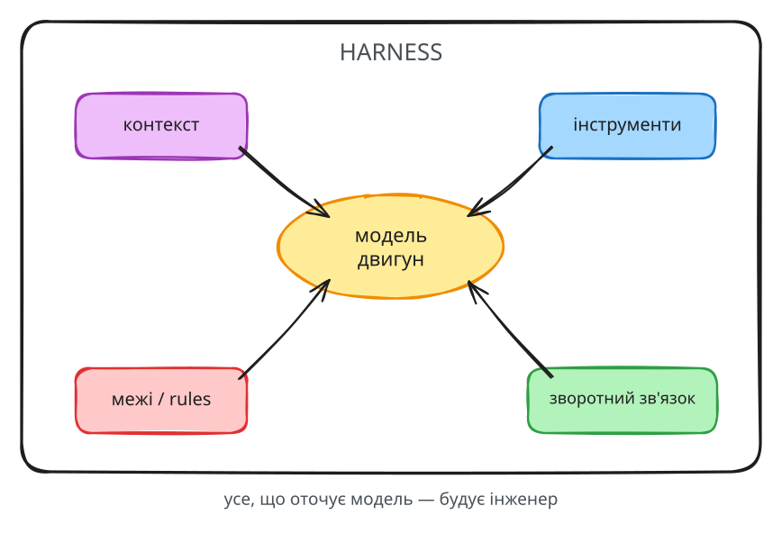

--

# Harness engineering for coding agent users

## https://martinfowler.com/articles/harness-engineering.html

--

# Harness engineering codex

## https://openai.com/uk-UA/index/harness-engineering/

--

--

# Sensors
## lints, type system, tests, CI, hooks

--

# Guides
## AGENTS.md, skills, rules, MCP, docs (adr, spec), architecture

--

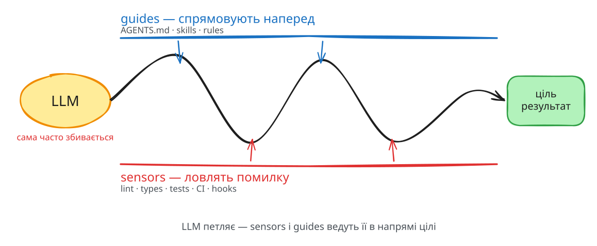

---

<!-- .slide: data-background-color="#ffffff" -->

02

# Guides

--

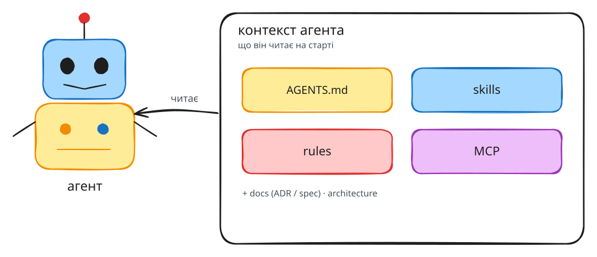

--

# Context - обмежений ресурс

---

<!-- .slide: data-background-color="#ffffff" -->

04

# AGENTS.md

## Always-on context

Note:
Перехід до конкретних інструментів guide. AGENTS.md — найбазовіший.

--

## Завжди в контексті

**Кожен** запит агента містить інструкції з `AGENTS.md`.

Тому ціна кожного рядка тут — висока.

--

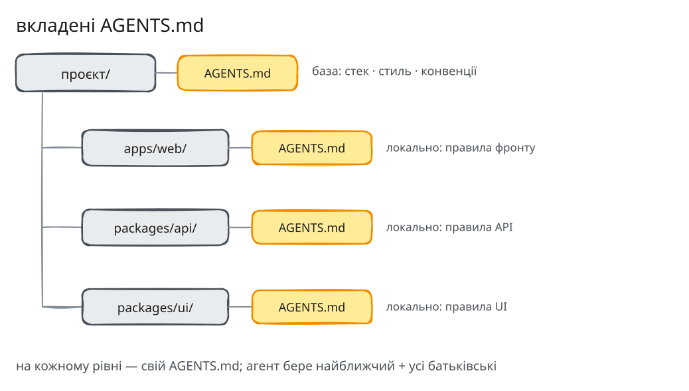

--

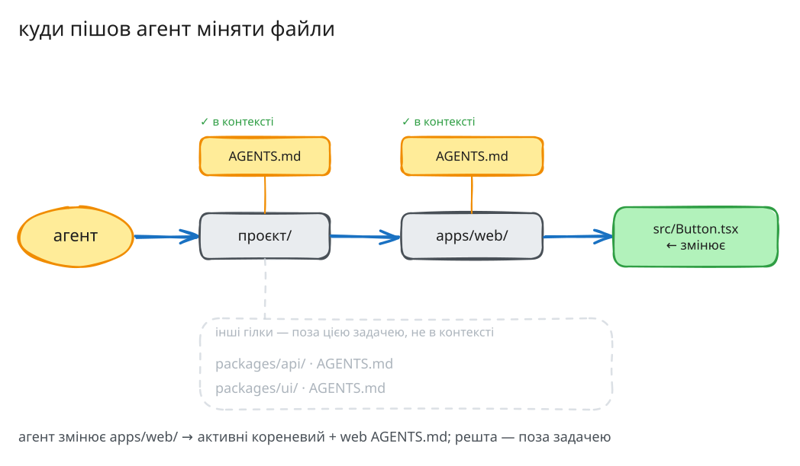

--

## Два дослідження, що сперечаються

  

### За

runtime **−28.6%**, output-токени **−16.6%**

→ швидше й дешевше
https://arxiv.org/pdf/2601.20404
  

  

### Проти

наявність файлу часто **−20% success rate**

overview = антипаттерн
https://arxiv.org/abs/2602.11988v1
  

Note:
Чесно показати конфлікт. Висновок не "файл поганий", а "вміст вирішує": інструкції — так, оглядовий переказ репо — ні.

--

## Практика

- Checklist для `AGENTS.md`: інструкції, не переказ
- **Вкладені** `AGENTS.md` — локальний контекст там, де він потрібен

Note:
Вкладені файли — спосіб не роздувати кореневий: специфіка пакета лежить поруч із пакетом.

--

AGENTS.md · checklist

<h2 style="color:#2f9e44; margin-bottom:0.1em">Що МАЄ бути</h2>

### Review Людиною, не ШІ

не `/init`, не автоген

−3% success · +20% вартості

### Лише мінімум

тільки найкритичніше для роботи з кодом

### Конкретний tooling

`uv` · `pytest` · `pdm` · скрипти репо

найкорисніша частина

Note:
1. Написано людиною, а не згенеровано ШІ — не /init. Згенеровані файли: −3% success rate, +20% вартості агента.
2. Лише мінімальні вимоги — тільки найкритичніше для роботи з кодом; необов'язкове лише ускладнює задачу.
3. Чітко вказаний tooling (uv, pytest, pdm, унікальні скрипти репо) — найкорисніша частина; агенти слухняно виконують прямі вказівки.

--

AGENTS.md · checklist

<h2 style="color:#e03131; margin-bottom:0.1em">Чого НЕ треба</h2>

### Огляд структури репо

перелік директорій не допомагає — зайві кроки

### Дублювання доки

не копіюй `docs/`, інші `.md`, приклади коду

### Зайві «думати»-правила

стиль, дрібна архітектура

+22% токенів роздумів

Шпаргалка з кількох команд → лишаємо · схоже на сторінку документації → скоротити

Note:
1. Огляди структури репо — не допомагають швидше знаходити файли; деякі моделі через них витрачають кроки на повторне перечитування цього ж файлу.
2. Дублювання документації — не копіюй docs/, інші .md, приклади коду; контекст-файли працюють як добра дока лише коли інших документів у репо нема.
3. Зайві правила стилю / другорядної архітектури → ШІ надмірно тестує, блукає по файлах, +22% "токенів роздумів" — дорожче, але не якісніше.
Головне правило валідації: якщо це шпаргалка з парою команд — ок; якщо повноцінна сторінка документації / архітектурний огляд — скоротити.

---

<!-- .slide: data-background-color="#ffffff" -->

05

# Skills + Rules

`.md` файл + `frontmatter` (YAML з метаданими)

Note:
Обидва механізми — це просто markdown із YAML-шапкою. Різниця — коли і як вони потрапляють у контекст.

--

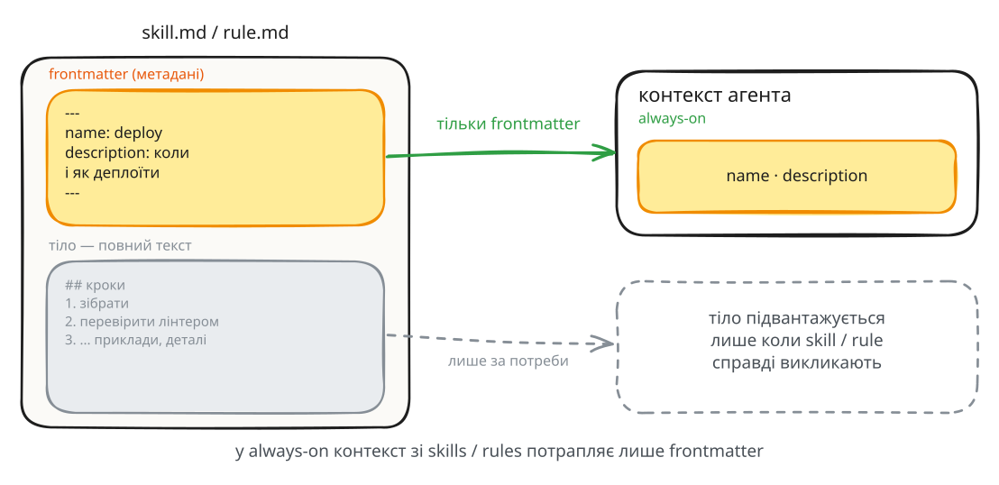

--

## Rules — path-scoped контекст

- Прив'язані до **шляхів** (`path: ...`)
- Без path це фактично доповнення `AGENTS.md`
- Приклади з `catalog-ui`:
  - rule для GraphQL-фрагментів
  - правила оновлення доки
  - LSP-first для TypeScript · typed REST API

Note:
Головне про rules: завжди давати path. Інакше вони always-on і втрачають сенс. Показати, що саме потрапляє в контекст і коли.

--

## Skills — прописані workflow-патерни

Повторювані процедури, які агент має робити **однаково щоразу**.

- Приклади з `catalog-ui`:
  - skill для створення mr
  - skill для створення jira ticket

Note:
Skills — це "ось як ми тут робимо X". Підвантажуються за потреби, а не висять у контексті постійно.

---

<!-- .slide: data-background-color="#ffffff" -->

06 · 07

# MCP + Plugins

Note:
Два зовнішні шари harness.

--

## MCP

Протокол для підключення зовнішніх тулзів і джерел.

`atlassian` · `context7`

Note:
MCP розширює, до чого агент має доступ: таски, доки, зовнішні API.

--

## Plugins

Набори скілів, хуків і скриптів для організації процесу.

**superpowers**: brainstorm · TDD · subagent · worktree · review

Note:
Плагіни пакують усталений процес. superpowers — приклад: цілий конвеєр розробки як набір скілів.

---

<!-- .slide: data-background-color="#ffffff" -->

08 · 09

# Документація

## Пам'ять, яку агент може знайти

Note:
Доки — це довготривалий context, який не висить у вікні, але доступний за пошуком.

--

## Шари доки

- **spec** — як щось робили
- **ADR** — чому щось робили
- **docs/conventions** — конвенції рівня репозиторія
- **індекс доки** — спрощує пошук (README з посиланнями)

Note:
Розділення spec/ADR ключове: рішення (чому) живуть окремо від реалізації (як).

--

# Doc index

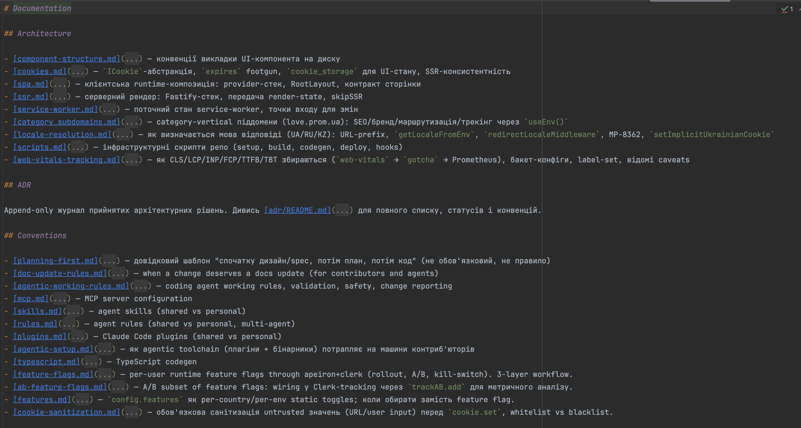
--

# /doc-capture skill

--

# ADR

## Architecture Decision Record

- Одне рішення = один файл. Короткий запис: контекст → рішення → наслідки.
- Ловить «чому». Код показує що зроблено; ADR пояснює, чому саме так і які альтернативи відкинули.
- Immutable. Рішення не редагують — застаріле помічають superseded новим ADR. Видно еволюцію думки.
- Для агента — це втрачений контекст. Без ADR агент не знає, що рішення навмисне, і «виправляє» його назад. З ADR — поважає межу.

--

## Інтеграція в catalog-ui

На *create-mr* skill додали перевірку чи потрібно додати *ADR*

--

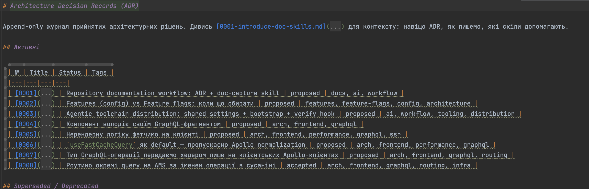

--

# /propose-adr skill

---

<!-- .slide: data-background-color="#ffffff" -->

10

# catalog-ui setup

--

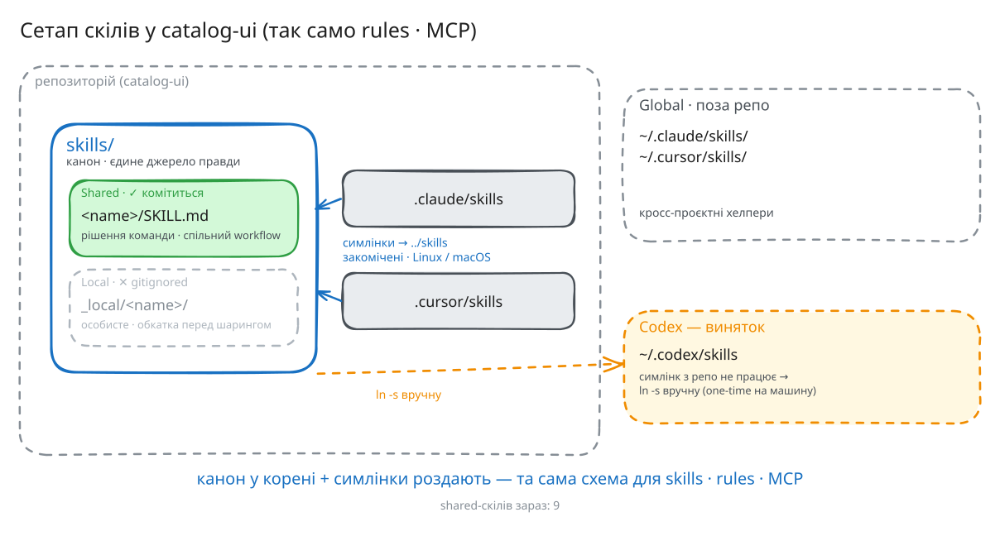

--

## https://gitlab.evo.dev/ai-tools/ai-registry/-/tree/main/skills?ref_type=heads

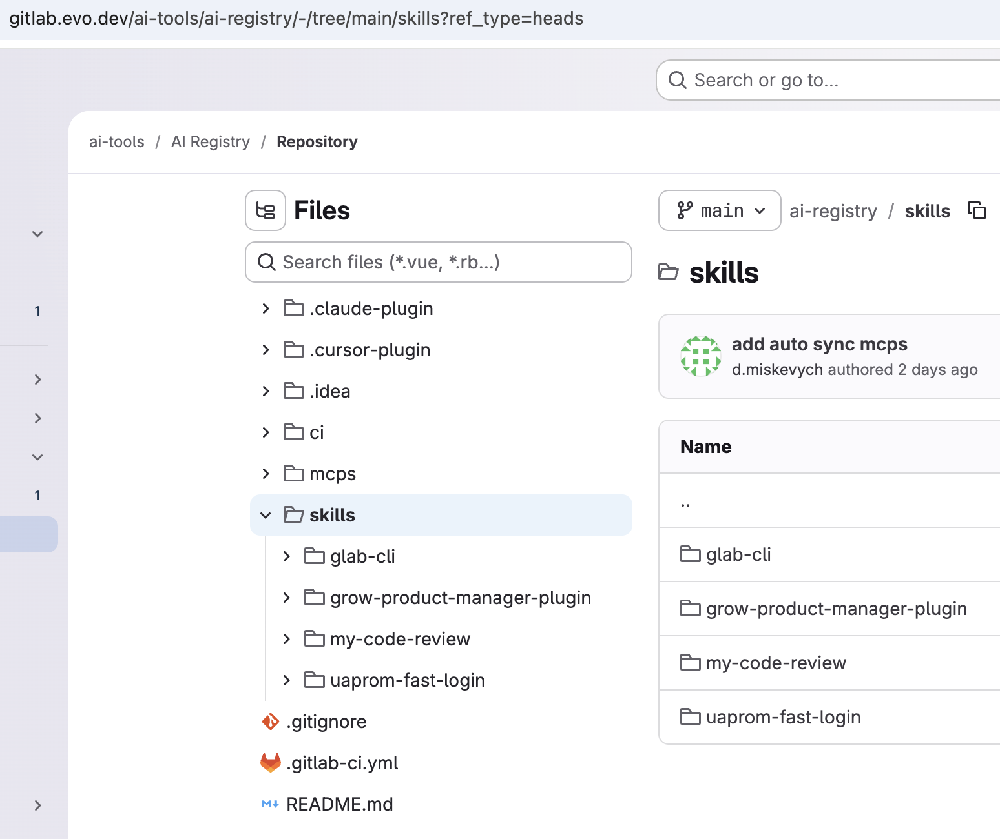

---

<!-- .slide: data-background-color="#ffffff" -->

11

# Takeaway

--

<!-- .slide: data-background-color="#ffffff" -->

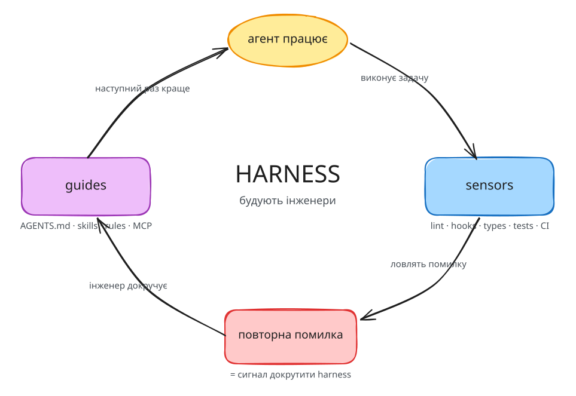

--

# agent first flow

## AI agent - точка входу для будь якого workflow

- додай скіл
- додай rule
- як працює щось
- беремо задачу SHOPEX-34343 в роботу
- додаємо тест
... 

--

## Ключові думки

- Harness будують **інженери** — не модель
- Агент повторює помилку → сигнал **докрутити harness**
- Починай із **sensors**, потім **guides**

--

<!-- .slide: data-background-color="#ffffff" -->

# Дякую

https://t.me/ainomadic

