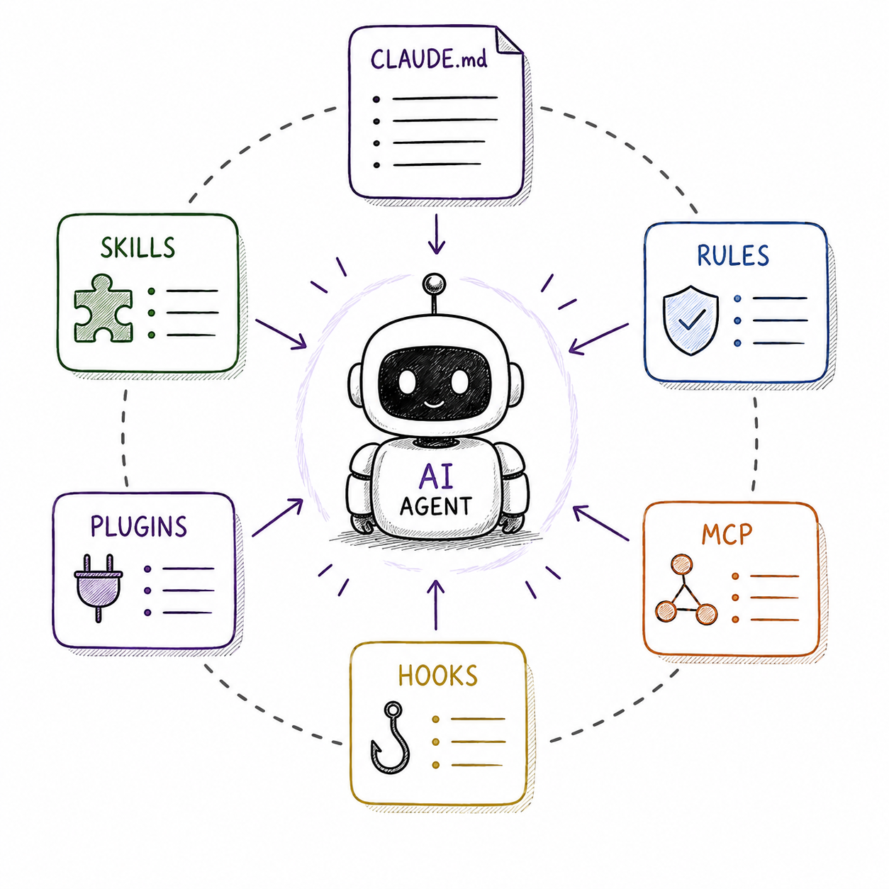
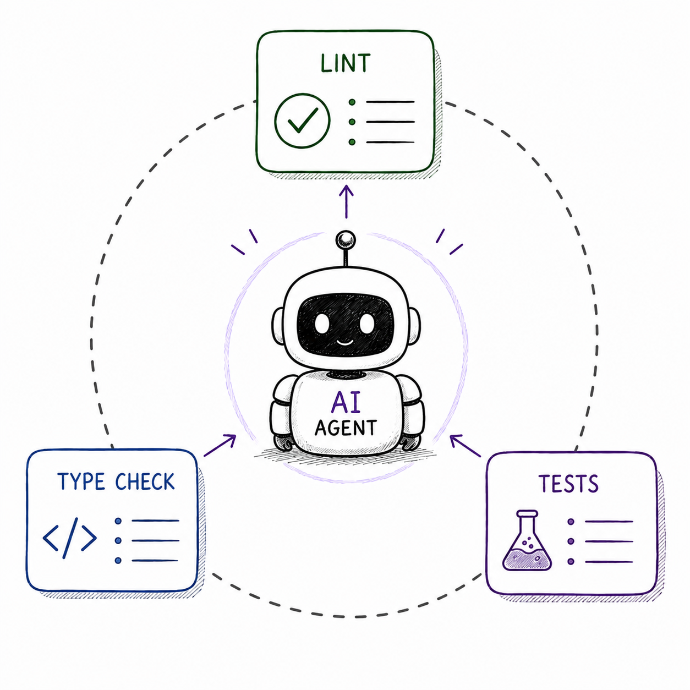
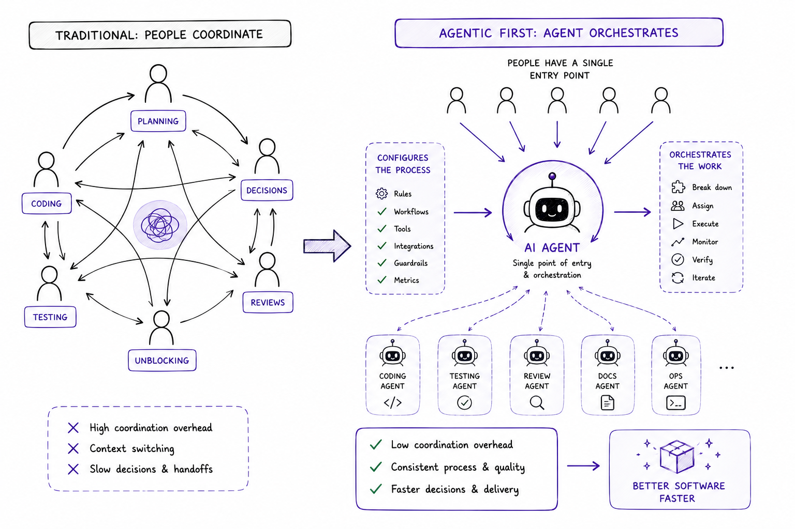
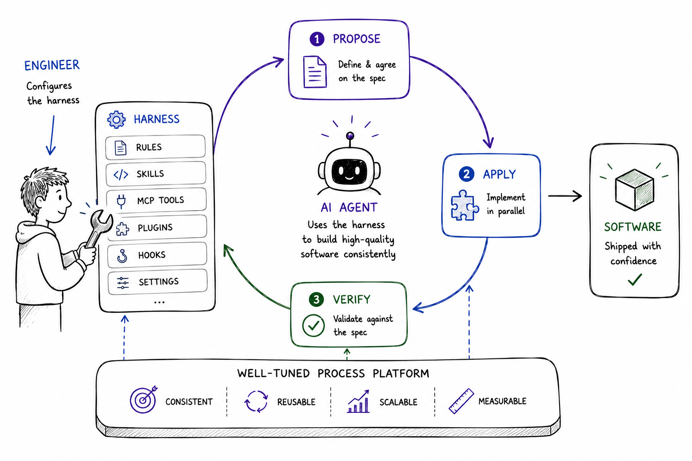

<!-- .slide: data-background-image="img/bg/title.jpg" -->

<!-- титульний слайд івенту — чистий фірмовий фон -->

Note:
Привітання. Це слайд-обкладинка івенту, на ньому нічого не кажемо — одразу перемикаємось на представлення.

---

evo AI DAY · 12 червня

# Від вайбкодінгу до Агентної інженерії

чому якість софту визначає процес, а не модель

Олександр Мостовенко

Note:
Хто я, чим займаюсь, чому ця тема. Одне речення про контекст: останній місяць будую робочі флоу з AI-агентами і хочу поділитись, що з цього вийшло.

---

## Трохи історії

---

---

---

---

# Chain of Thought (CoT)

## https://arxiv.org/abs/2201.11903

---

# CoT, ToT, ReAct...

---

# Agent

---

---

---

---

# Вайбкодінг

---

https://x.com/karpathy/status/1886192184808149383?s=20

---

---

---

# Переваги vibe coding

<ul>
<li class="fragment">інструмент, який <mark>прибирає бар'єр</mark> — поекспериментувати, запустити, перевірити ідею</li>
<li class="fragment">без команди, без бюджету, без занурення в стек</li>
</ul>

Note:
Посил: це мега круто. Людина без техбекграунду (або інженер без вільного вечора) втілює ідею одразу, поки вона жива. Бар'єр, який раніше складався з команди, бюджету і тижнів сетапу, стиснувся до промпта. Звідси міст до наступного слайда: чому ж тоді це не скрізь працює.

---

## Від думки до реалізації відділяють лише токени та здатність сформулювати ідею

---

## Ви самі маючи ідею і бачення краще знаєте який продукт хочете побудувати

---

# Engineering solved?

---

---

---

## Не роби помилок!

---

## Не роби багів!

---

## Не роби багів!!!

---

## Ти найдосвідченіший розробник на планеті!!! 
## маєш 30 років досвіду роботи...

---

## маєш 3000 років досвіду роботи!!!

---

---

## Чому так відбувається?

---

---

---

---

---

# Software Entropy

---

## Софт сам по собі не стає простішим. Без постійного догляду він стає складнішим.

- David Thomas & Andrew Hunt

---

# Context engineering

---

# Lost in the Middle: How Language Models Use Long Contexts

## https://arxiv.org/pdf/2307.03172
---

# Context - обмежений ресурс

---

---

---

## John Ousterhout

---

# «Складність — це будь-що, пов’язане зі структурою програмної системи, що робить важким розуміння та модифікацію системи».
## - John Ousterhout

---

# Code is cheap

https://www.youtube.com/watch?v=v4F1gFy-hqg

---

# Code * Fail risk = $

---

---

---

---

---

# Agentic Engineering

https://www.youtube.com/watch?v=96jN2OCOfLs

---

# Головна мета "агентної інженерії"
## Полягає не просто у швидкості, а у збереженні <mark>високих стандартів</mark> професійного софту

---

# Людина має "залишатися в циклі"
## Моделі бувають непередбачуваними у своїх можливостях, тому їх треба сприймати як <mark>інструменти</mark> і постійно стежити за їхніми діями

---

# Відповідальність за архітектуру <mark>лежить на людині</mark>
## Людина має повністю відповідати за специфікації, план розробки, дизайн та інженерний смак

---

# ШІ погано справляється з архітектурою
## Карпатий зізнається, що іноді згенерований код викликає у нього "серцевий напад", оскільки він може працювати, але при цьому бути дуже роздутим, містити "незграбні абстракції, які є крихкими"

---

---

## Agent - надзвичайно здібний стажер який не втомлюється і завжди готовий до виконання задач.

---

# Швидкість vs Якість

---

## Чому агент помиляється?

---

## AI зробив не те що я просив

---

# No-one knows exactly what they want

- David Thomas & Andrew Hunt (Pragmatic Programmer)

---

---

# Синхронізація ментальної моделі

Note:
Проблема не нова (no-one knows exactly what they want) — AI її лише загострив: ціна розбіжності впала з тижнів до хвилин, тому узгоджувати картини треба ДО коду. Міст до plan mode: саме тому в агентах це вбудований режим, а не звичка ентузіастів.

---

# Plan mode

---

# /superpowers:brainstorming
# /grill-me
# /grill-me-with-docs

---

---

Note:
Раніше пояснював задачу качечці — інсайт був випадковим. Тепер качечка відповідає і допитує. Перший ефект формалізації: поки не сів формулювати — здається, що все ясно; питання агента показують, що ні.

---

# Agent = Harness + LLM

---

## Harness Engineering

---

---

---

---

# TDD

---

# superpowers:tdd

---

## superpowers:subagent-driven-development

---

# Core principle
## Fresh subagent per task + two-stage review 
## (spec then quality) = high quality, fast iteration

---

# SDD (OpenSpec)
## https://github.com/Fission-AI/OpenSpec/

---

---

# OpenSpec + Superpowers

<ul>
    <li class="fragment">Синхронізація ментальної моделі</li>
    <li class="fragment">Кращі практики розробки вшиті в процесс</li>
    <li class="fragment">Можливість налаштовувати/впроваджувати процесс</li>
    <li class="fragment">Автооновлення документації</li>
    <li class="fragment">Системне покращення Harness</li>
</ul>

---

# Agent native / Agent first

---

---

---

---

---

---

---

## Простіше/швидше самому?

<ul>
    <li class="fragment">Тести</li>
    <li class="fragment">Документація</li>
    <li class="fragment">Моніторинг CI</li>
    <li class="fragment">Оновлення задачі в jira</li>
</ul>

---

# Loops

---

---
- https://ghuntley.com/loop/
- https://addyosmani.com/blog/loop-engineering/
- https://www.anthropic.com/engineering/effective-harnesses-for-long-running-agents
- https://www.anthropic.com/engineering/harness-design-long-running-apps
- https://openai.com/uk-UA/index/harness-engineering/
---

# Висновки

<ul>
    <li class="fragment">Концентруйтесь на можливостях</li>
    <li class="fragment">Будуйте процес</li>
    <li class="fragment">Баланс якість vs швидкість</li>
    <li class="fragment">Інженер відповідальний за архітектуру і якість</li>
    <li class="fragment">Людина — в центрі архітектури, як <mark>диригент</mark>: агенти грають, ви тримаєте задум і темп</li>
</ul>

Note:
Фінальний образ: harness — це оркестр. Агенти — виконавці, sensors і guides — партитура, але диригент — людина: задає задум, тримає темп, чує, коли хтось фальшивить. Без диригента оркестр грає голосно, але не музику. Це відповідь і на «engineering solved?» з початку — ні, роль інженера не зникла, вона піднялася на рівень вище.

---

# Відкриті питання

<ul>
    <li class="fragment">Вартість agent first систем</li>
    <li class="fragment">Вимірювання загальної ефективності системи</li>
    <li class="fragment">Безпека</li>
</ul>

---

# Дякую!

## https://t.me/ainomadic

