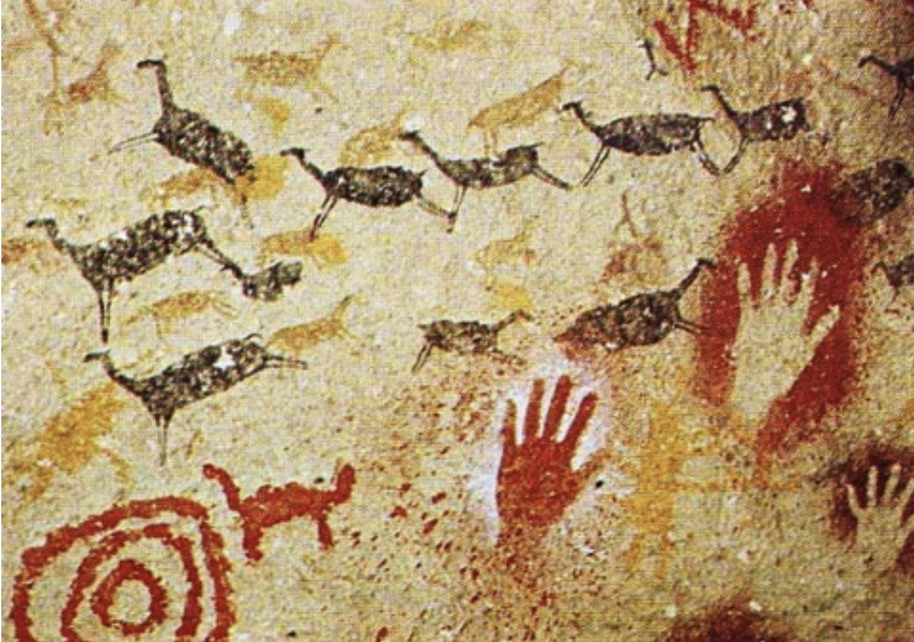
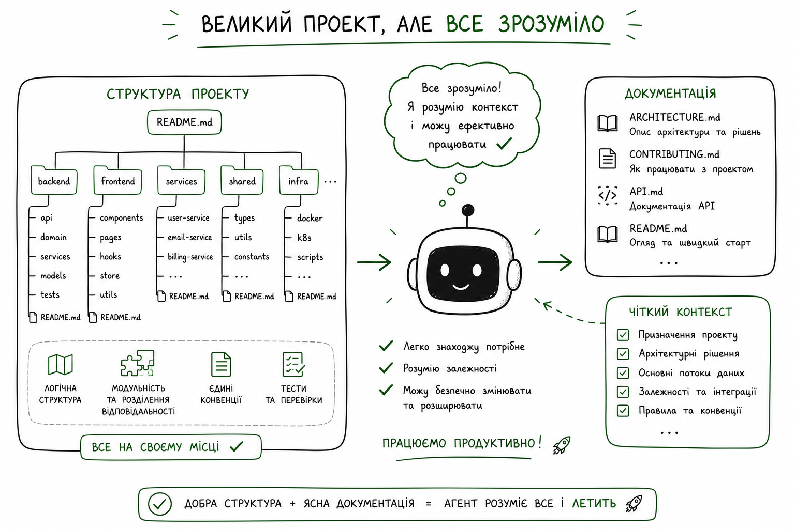
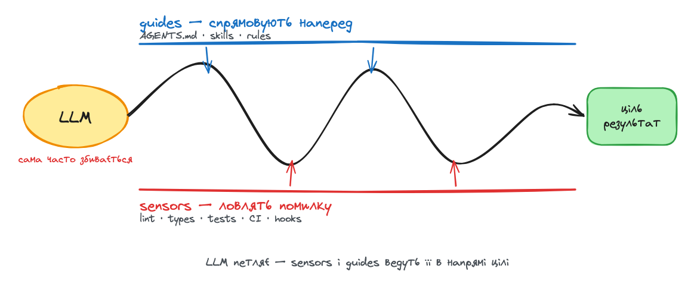
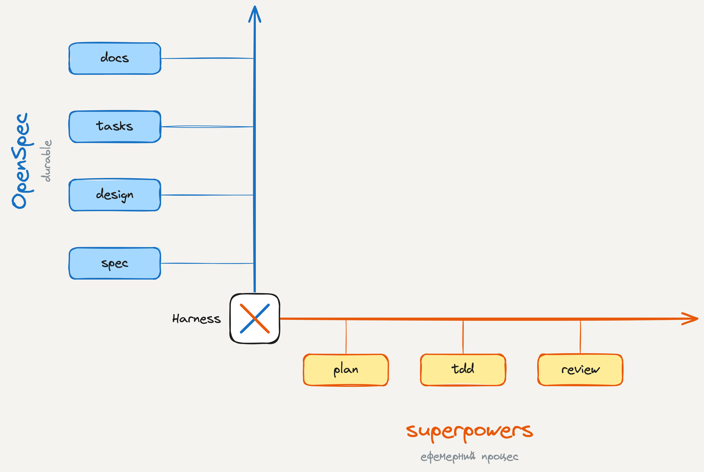
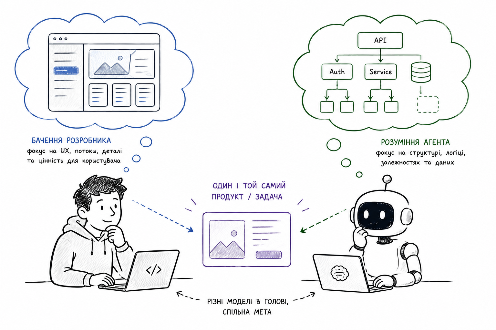
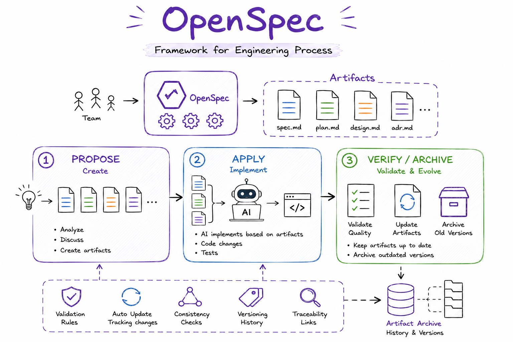
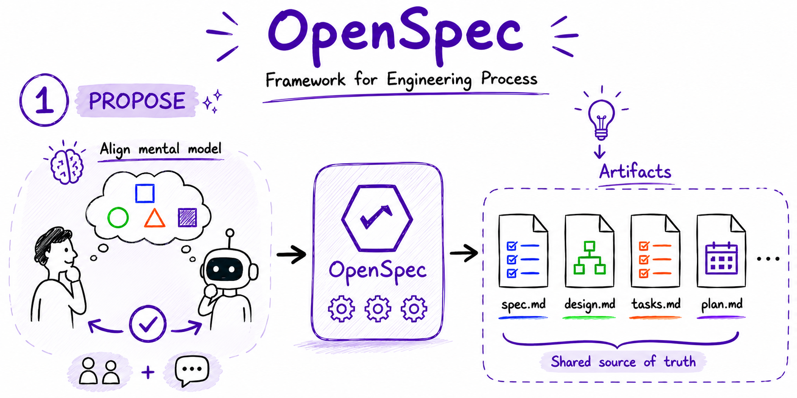
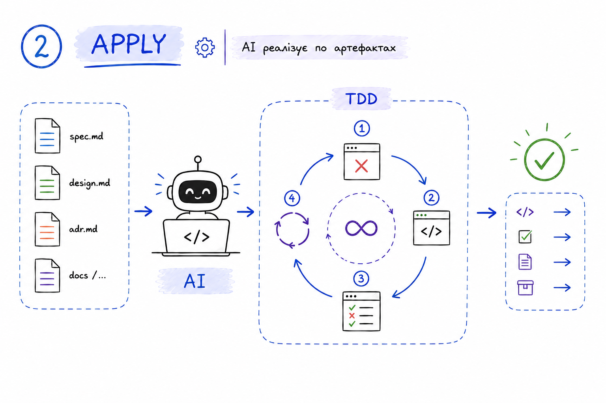
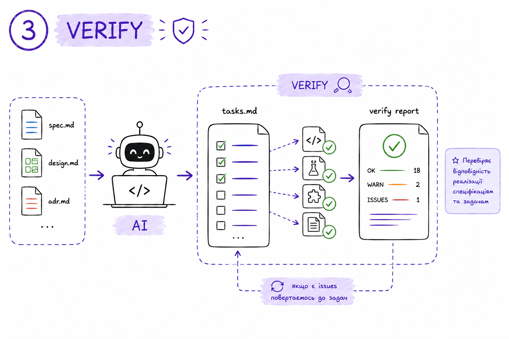
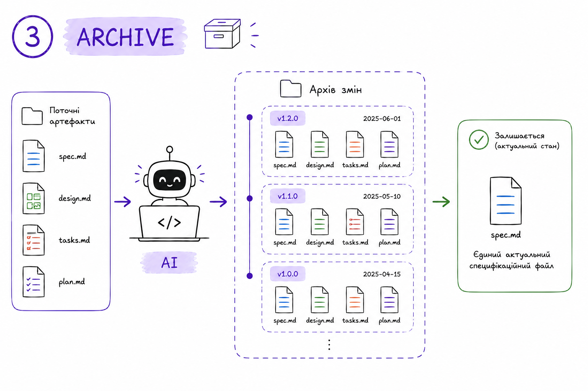

# Дві осі SDD

специфікація і процес — дві ортогональні осі

spec axis
process axis

Олександр Мостовенко

Note:
Жанр — «разом розбираємось», не «я навчу». Я в середині розбирання, ділюся тим, що зрозумів і де ще спотикаюсь. Аудиторія — інженери, overview AI-first не треба.

---

about me

## Олександр Мостовенко

Software architect @ EVO

свій opensource → <a href="https://ttag.js.org/">ttag.js.org</a>

github → <a href="https://github.com/AlexMost">https://github.com/AlexMost</a>

---

бачив .NET framework 3.5, Silverlight, joomla, python 2.7, flask, django, jquery, angular 1.5  

---

# Дві осі SDD
## Spec Driven Development

---

# Agentic Engineering

---

# Vibe Coding

---

---

# Agentic Engineering

## https://www.youtube.com/watch?v=96jN2OCOfLs

---

# Головна мета "агентної інженерії"
## Полягає не просто у швидкості, а у збереженні <mark>високих стандартів</mark> професійного софту

---

## https://www.kaggle.com/whitepaper-the-new-SDLC-with-vibe-coding

---

---

---

## https://www.youtube.com/watch?v=v4F1gFy-hqg

---

---

---

## Agentic Engineering

<ul>
    <li class="fragment">Архітектура (System Design)</li>
    <li class="fragment">Кращі практики розробки (СI/CD, TDD, code review)</li>
    <li class="fragment">Harness Engineering</li>
</ul>

---

# Harness Engineering

## https://martinfowler.com/articles/harness-engineering.html

---

---

---

## Дві осі SDD

---

# Process axis
## superpowers

---

# Plan

<ul>
    <li class="fragment">Plan mode</li>
    <li class="fragment">/superpowers:brainstorming</li>
    <li class="fragment">/grill-me</li>
</ul>

---

# Синронізація ментальної моделі

---

# TDD
## superpowers:test-driven-development
## tdd mattpocock

---

# Parallel execution (orchestration)
## superpowers:ubagent-driven-development

---

# Code review
## superpowers:subagent-driven-development

---

# Spec axis

---

# Openspec

## https://openspec.dev/
---

---

# superpowers spec != openspec spec.md

---

# superpowers spec.md plan.md
## Актуальні під час виконання задачаі

---

## ... треба розібрати що таке openspec технічно (cli + набір скілів)

---

## ... init

---

# /opsx:propose

---

# /opsx:apply

---

## worktree

---

# /opsx:verify

---

# /opsx:archive

---

---

---

# ... тут треба слайд що на етапі propose і verify людина включається. Етап apply чисто для ШІ

---

# ... далі пункт як подружити supoerspo
---
# Дякую
## Ділюсь думками про AI інженерію тут

@ainomadic

Олександр Мостовенко <a href="https://t.me/ainomadic">t.me/ainomadic</a>

Note:
Фінальний слайд під Q&A — QR лишається на екрані поки йдуть питання, встигнуть відсканувати.
