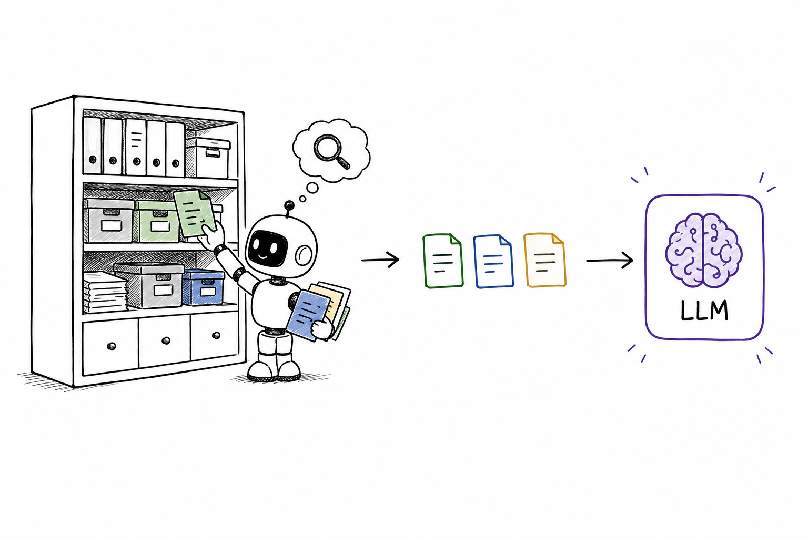
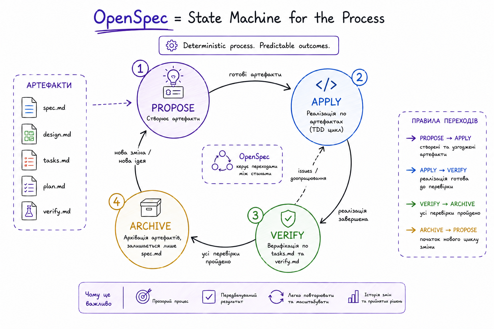
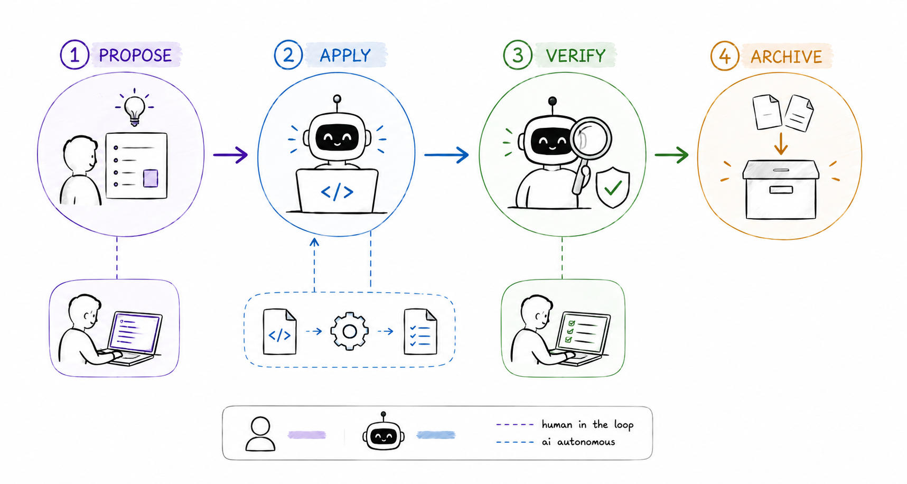

# Дві осі SDD

специфікація і процес — дві ортогональні осі

spec axis
process axis

Олександр Мостовенко

Note:
Жанр — «разом розбираємось», не «я навчу». Я в середині розбирання, ділюся тим, що зрозумів і де ще спотикаюсь. Аудиторія — інженери, overview AI-first не треба.

---

about me

## Олександр Мостовенко

Software architect @ EVO

свій opensource → <a href="https://ttag.js.org/">ttag.js.org</a>

github → <a href="https://github.com/AlexMost">https://github.com/AlexMost</a>

---

бачив .NET framework 3.5, Silverlight, joomla, python 2.6, flask, django, jquery, angular 1.5  

---

# Дві осі SDD
## Spec Driven Development

---

# Agentic Engineering

---

# Vibe Coding

---

---

# Agentic Engineering

## https://www.youtube.com/watch?v=96jN2OCOfLs

---

# Головна мета "агентної інженерії"
## Полягає не просто у швидкості, а у збереженні <mark>високих стандартів</mark> професійного софту

---

## https://www.kaggle.com/whitepaper-the-new-SDLC-with-vibe-coding

---

---

---

## https://www.youtube.com/watch?v=v4F1gFy-hqg

---

---

---

## Agentic Engineering

<ul>
    <li class="fragment">Архітектура (System Design)</li>
    <li class="fragment">Кращі практики розробки (СI/CD, TDD, code review)</li>
    <li class="fragment">Harness Engineering</li>
</ul>

---

# Harness Engineering

## https://martinfowler.com/articles/harness-engineering.html

---

---

---

## Дві осі SDD

---

# Process axis
## superpowers

---

# Plan

<ul>
    <li class="fragment">Plan mode</li>
    <li class="fragment">/superpowers:brainstorming</li>
    <li class="fragment">/grill-me</li>
</ul>

---

# Синронізація ментальної моделі

---

# Context engineering

---

# TDD
## superpowers:test-driven-development
## tdd mattpocock

---

# Parallel execution (orchestration)
## superpowers:subagent-driven-development

---

# Code review
## superpowers:subagent-driven-development

---

# Spec axis

---

# Openspec

## https://openspec.dev/
---

---

# superpowers spec != openspec spec.md

---

# superpowers spec.md plan.md
## Актуальні під час виконання задачаі

---

# Openspec під капотом

<ul>
    <li class="fragment">openspec cli - prompt generator + state machine</li>
    <li class="fragment">agent skills/commands</li>
</ul>

---

# openspec init

---

## /opsx:propose -> /opsx:apply -> /opsx:verify -> /opsx:archive

---

# /opsx:propose

---

# /opsx:apply

---

## worktree

---

# /opsx:verify

---

# /opsx:archive

---

---

---

spec axis

# Оновлення специфікації

зміна не переписує спеку — вона описує дельту

Note:
Ключова ідея spec-осі: коли зміна чіпає поведінку, вона не редагує канонічну спеку напряму. Вона кладе delta-файл — набір операцій над вимогами. Канонічна спека оновлюється лише на archive.

---

## Дельта-операції

<ul>
  <li class="fragment"><code>ADDED</code> — нова вимога</li>
  <li class="fragment"><code>MODIFIED</code> — змінена, з <b>повним</b> новим текстом</li>
  <li class="fragment"><code>REMOVED</code> — прибрана, з <code>Reason</code> + <code>Migration</code></li>
  <li class="fragment"><code>RENAMED</code> — <code>FROM:</code> / <code>TO:</code></li>
</ul>

delta = контракт зміни, а не diff

---

openspec archive

## Дельта → жива спека

<b>дельта зміни</b>

changes/…/specs/auth-google/spec.md

ADDED · MODIFIED · REMOVED

<b>канонічна спека</b>

specs/auth-google/spec.md

8 вимог, без маркерів

жива спека = <mark>сума застосованих дельт</mark>

Note:
На archive CLI зливає дельти в openspec/specs/<capability>/spec.md. У канонічній спеці вже НЕМАЄ маркерів ADDED/MODIFIED/REMOVED — тільки поточний стан. Приклад: «Role assigned from allowlist config» тепер живе в specs/auth-google/spec.md, а «Hardcoded operator role» звідти зникла.

---

spec axis · CI

# Спека — машинно-перевірювана

merge-гейт: невалідна спека → червоний CI

<code>openspec validate --all --strict</code>

exit ≠ 0 — PR не мержиться

Note:
CI-рецепт (GitHub Actions, один крок):
  - run: npx @fission-ai/openspec@latest validate --all --strict
Що ловить: Scenario не з 4 решіток (#### — інакше тихо ігнориться), вимога без SHALL/MUST, вимога без жодного сценарію, битий delta-хедер. Команда виставляє exitCode=1 і робить process.exit → чесно валить білд. Це та сама перевірка, що verify.md §1 робить усередині workflow (`openspec validate --all --json`), тільки на CI вона не залежить від агента.

---

## «Всі зміни зроблені» = 3 рівні

<ul>
  <li class="fragment"><b>структура</b> — <code>openspec validate --all --strict</code></li>
  <li class="fragment"><b>таски</b> — у tasks.md не лишилось <code>- [ ]</code></li>
  <li class="fragment"><b>архів</b> — дельти влиті в <code>specs/</code>, немає висячих changes</li>
</ul>

verify-фаза кодифікує всі три в самому workflow

Note:
Рівень 1 — вбудований чистий CI-гейт. Рівні 2-3 — простий grep у CI: незакриті чекбокси в openspec/changes/*/tasks.md (поза archive/) або наявність незаархівованої зміни = «ще не готово, не мерж». У superpowers-bridge усі три вже зашиті у verify.md (§1 validate, §2 task completion, §3 delta-sync) + config rules.verify з репо-гейтами (pnpm test / lint / typecheck / format:check). Тобто те, що агент робить у verify-артефакті, CI дублює як незалежний страж перед мержем.

---

---

---

## worktree

---

# Openspec + superpowers
https://github.com/JiangWay/openspec-schemas/tree/main/superpowers-bridge

---

висновок

## Дві осі — це один harness

<b>spec axis</b>

що і чому

docs · specs · ADR

<b>process axis</b>

як і наскільки добре

plan · TDD · review

не бюрократія — <mark>середовище, у якому агент працює ефективно</mark>

Note:
Повернення до тези відкриття: дві ортогональні осі. Тепер зводимо їх в одне ім'я — harness. Це той самий Harness Engineering з початку доповіді, тільки конкретно: спека-вісь дає агенту «що і чому», процес-вісь — «як і наскільки добре».

---

## Чому harness підсилює агента

<ul>
  <li class="fragment"><b>specs / ADR</b> — пам'ять агента між сесіями: що і чому</li>
  <li class="fragment"><b>plan / TDD / review</b> — планка якості, винесена з голови сеньйора назовні</li>
  <li class="fragment">без harness агент щоразу <b>перевигадує контекст</b> і дрейфує</li>
</ul>

harness = зовнішній контекст + зовнішня дисципліна

Note:
Ключовий інсайт доповіді. Агенту вроджено бракує двох речей: пам'яті між сесіями і власної планки якості. Harness дає обидві — специфікації/ADR як зовнішня пам'ять, TDD/review/plan як зовнішня дисципліна. Те, що сеньйор тримає в голові, ми виносимо назовні у файли — і тоді на цю базу може стати будь-який агент у будь-якій сесії.

---

# conductor -> orchestrator

## https://www.kaggle.com/whitepaper-the-new-SDLC-with-vibe-coding

---

# Дякую
## Ділюсь думками про AI інженерію тут

@ainomadic

Олександр Мостовенко <a href="https://t.me/ainomadic">t.me/ainomadic</a>

Note:
Фінальний слайд під Q&A — QR лишається на екрані поки йдуть питання, встигнуть відсканувати.
