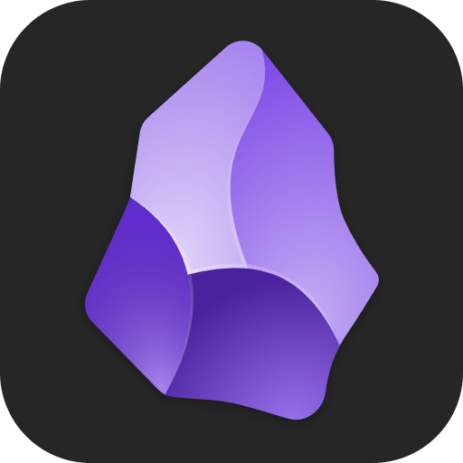
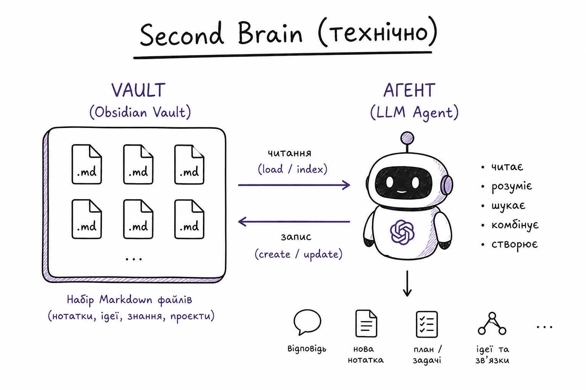
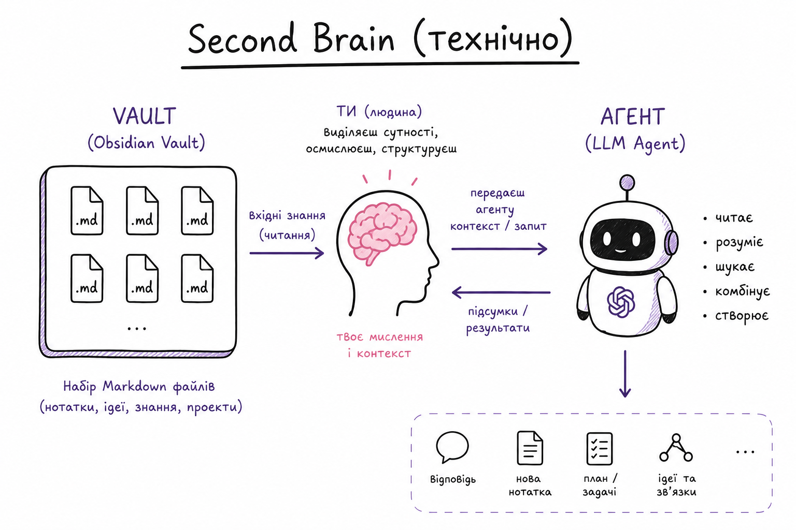
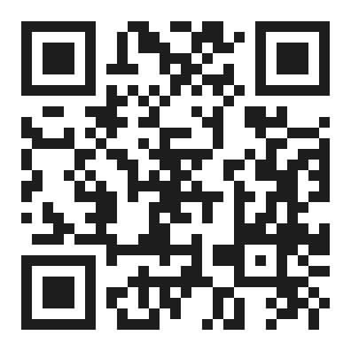

---

# LLM Wiki vs Second Brain

особиста база знань на Obsidian + Claude Code

second brain
llm wiki

Олександр Мостовенко

---

# Про що ця доповідь

- Досвід побудови personal knowledge system
- Може бути в нагоді всім хто вчиться, створює, планує.

---

# Second Brain vs LLM Wiki

---

# Second Brain

---

# LLM Wiki (Wiki)

---

---

# Obsidian vault

- Markdown files + metadata
- links

---

# .md files + frontmatter

---

# Open Knowledge Format (Google)
https://cloud.google.com/blog/products/data-analytics/how-the-open-knowledge-format-can-improve-data-sharing

---

# PARA - організаційна система

- Projects
- Areas
- Resources
- Archives

---

# Enough for second brain?

---

# Lets add AI

---

---

# LLM Wiki

## https://gist.github.com/karpathy/442a6bf555914893e9891c11519de94f

- Raw sources
- Агент сам розкидує по сутностях
- Агент проставляє звʼязки

---

# Agents Brain

- Docs
- Company knowledge base
- ...

---

---

# Obsidian як інструмент мислення

---

# Zettelkasten

## Метод управління знаннями та ведення нотаток, що використовується в дослідженнях і навчанні

---

---

# Evergreen notes

## Концепція створення заміток, які розробляються та уточнюються з часом, а не просто записуються і забуваються

---

# Obsidian допомагає вести декілька одночасних справ

- Дамп думок ідей
- Планування
- Задачі

---

# Personal knowledge system setup = evolution

---

# Серендипність

## Випадковий інсайт

---

# Grep + Read

---

## neuro-vault-mcp

# https://github.com/AlexMost/neuro-vault

---

---

# search_notes

## One call:
- Semantic search
- Lexical search

---

> запропонуй тему доповіді із того що я рісьорчив останнім часом

---

# модель для embeddings

# bge-micro-v2 — 17MB, 17M - params, 384 dims, 512 tokens

https://huggingface.co/docs/transformers.js/en/index

---

# Transformers.js

https://www.npmjs.com/package/@xenova/transformers

---

> який в мене прогресс з ReAct паттерном, хочеться далі вивчати цей напрям

---

# query_notes

---

---

# Outside vault usage

---

> проведи аудит AGENTS.md в цьому репо (базуючись на моєму чеклісті із vault)

---

# Adoption 

---

---

# Висновки

<ul>
    <li class="fragment">Second brain потребує first brain</li>
    <li class="fragment">Будуйте його еволюційно під свої потреби</li>
    <li class="fragment">Agent as admin</li>
    <li class="fragment">Фіксуйте правила (skills, rules, AGENT.md, System)</li>
</ul>

---

# Neuro vault

## https://github.com/AlexMost/neuro-vault

---

# Дякую
## Ділюсь думками про AI інженерію тут

@ainomadic

Олександр Мостовенко <a href="https://t.me/ainomadic">t.me/ainomadic</a>

Note:
Фінальний слайд під Q&A — QR лишається на екрані поки йдуть питання, встигнуть відсканувати.
